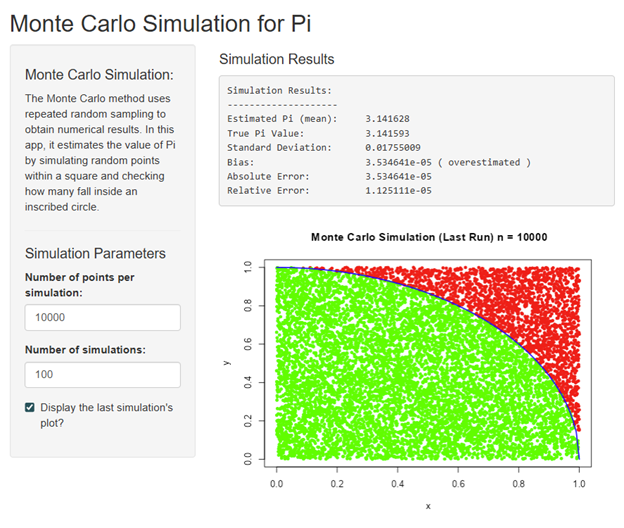

```{r setup, include=FALSE}
knitr::opts_chunk$set(echo = TRUE)
```

# Monte Carlo Pi Simulation App

This is a simple Shiny application that demonstrates the Monte Carlo method for estimating the value of Pi. The app allows users to adjust the simulation parameters and visualize a single instance of the simulation.



## Features

*   **Interactive Controls**: Easily set the number of points per simulation and the number of simulation runs using numeric input boxes.
*   **Toggle Plotting**: A checkbox allows you to decide whether to display the plot for the last simulation instance.
*   **Comprehensive Output**: The app provides a detailed summary of the simulation results, including:
    *   Estimated Pi value (the mean of all simulations).
    *   Standard deviation of the estimates.
    *   Bias of the estimation (with an indicator for overestimation, underestimation, or unbiased).
    *   Absolute and relative error compared to the true value of Pi.
*   **Clear Explanation**: A brief, in-app definition of the Monte Carlo method is included for clarity.

## How to use

### Prerequisites

To run this app, you need to have the following R packages installed:

*   `shiny`
*   `dplyr`

You can install them by running this command in your R console:

```r
install.packages(c("shiny", "dplyr"))
```

## Running the App

1. Save the provided `app.R` code into a file named `app.R` in your R working directory.
2. Run the application from your R console with the following command:

```r
shiny::runApp()

```

## How the simulation works
The Monte Carlo method for estimating Pi is based on the following principle:

1. **Generate Random Points**: A large number of random points are generated within a square (with corners at `(0,0)`, `(1,0)`, `(1,1)`, and `(0,1)`).

2. **Count Points in Circle**: The number of points that fall within the inscribed circle (the first quarter of a unit circle with a radius of 1) is counted.

3. **Calculate Pi**: The ratio of the area of the circle to the area of the square is \(\pi r^{2}/(2r)^{2}=\pi /4\). By calculating the ratio of the number of points in the circle to the total number of points, we can estimate \(\pi /4\) and, in turn, the value of \(\pi \).

This application runs this simulation multiple times (sim) to provide a more stable estimate of Pi and to calculate the standard deviation and bias of the estimation method.
