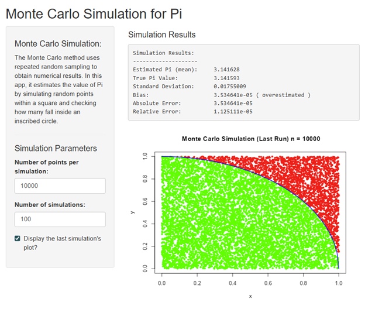

README
================
Chitra Karki

# Monte Carlo Pi Simulation App

This is a simple Shiny application that demonstrates the Monte Carlo
method for estimating the value of Pi. The app allows users to adjust
the simulation parameters and visualize a single instance of the
simulation.



## Features

- **Interactive Controls**: Easily set the number of points per
  simulation and the number of simulation runs using numeric input
  boxes.
- **Toggle Plotting**: A checkbox allows you to decide whether to
  display the plot for the last simulation instance.
- **Comprehensive Output**: The app provides a detailed summary of the
  simulation results, including:
  - Estimated Pi value (the mean of all simulations).
  - Standard deviation of the estimates.
  - Bias of the estimation (with an indicator for overestimation,
    underestimation, or unbiased).
  - Absolute and relative error compared to the true value of Pi.
- **Clear Explanation**: A brief, in-app definition of the Monte Carlo
  method is included for clarity.

## How to use

### Prerequisites

To run this app, you need to have the following R packages installed:

- `shiny`
- `dplyr`

You can install them by running this command in your R console:

``` r
install.packages(c("shiny", "dplyr"))
```

## Running the App

1.  Save the provided `app.R` code into a file named `app.R` in your R
    working directory.
2.  Run the application from your R console with the following command:

``` r
shiny::runApp()
```

## How the simulation works

The Monte Carlo method for estimating Pi is based on the following
principle:

1.  **Generate Random Points**: A large number of random points are
    generated within a square (with corners at `(0,0)`, `(1,0)`,
    `(1,1)`, and `(0,1)`).

2.  **Count Points in Circle**: The number of points that fall within
    the inscribed circle (the first quarter of a unit circle with a
    radius of 1) is counted.

3.  **Calculate Pi**: The ratio of the area of the circle to the area of
    the square is $\pi r^{2}/(2r)^{2}=\pi /4$. By calculating the ratio
    of the number of points in the circle to the total number of points,
    we can estimate $\pi /4$ and, in turn, the value of $\pi$.

This application runs this simulation multiple times (sim) to provide a
more stable estimate of Pi and to calculate the standard deviation and
bias of the estimation method.
