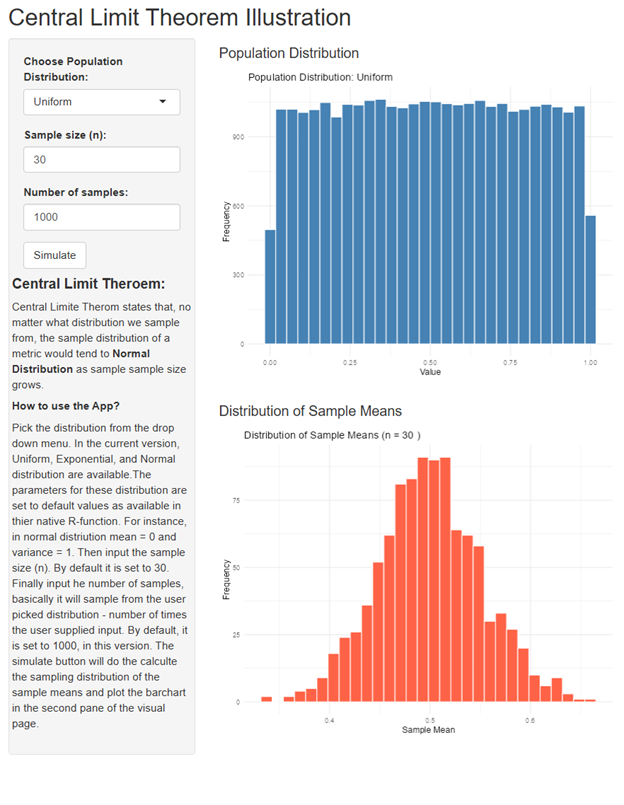

# Central Limit Theorem (CLT) Interactive Shiny App

This Shiny application provides an **interactive visualization of the
Central Limit Theorem (CLT)** using different population
distributions.  
Users can explore how the distribution of sample means approaches a
**normal distribution** as the sample size increases; regardless of the
population distribution.

The **Central Limit Theorem (CLT)** is one of the foundation results in
probability and statistics.  
It simpler words, **regardless of the shape of the population
distribution**, the **distribution of sample means** tends to be
**approximately normal** when the sample size (n) is sufficiently
large.

This app helps users *see* this idea in action through interactive
sampling and visualization.

## Features

-   Choose from **three population distributions**:
    -   Uniform (0, 1)
    -   Exponential (rate = 1)
    -   Normal (mean = 0, sd = 1)
-   Adjust the:
    -   **Sample size (n)**
    -   **Number of samples**
-   Visualize:
    -   The **original population distribution**
    -   The **distribution of sample means**
-   Dynamically simulate with a single click (`Simulate` button).

------------------------------------------------------------------------

## How It Works

1.  Select a population distribution from the dropdown.
2.  Set:
    -   The **sample size (n)** — how many observations per sample.
    -   The **number of samples** — how many samples to draw.
3.  Click **Simulate**.
4.  The app will:
    -   Draw samples from the chosen population.
    -   Compute the mean of each sample.
    -   Display:
        -   A histogram of the **population distribution**.
        -   A histogram of the **sample means** — illustrating the
            Central Limit Theorem in action.

------------------------------------------------------------------------

## ️ App Preview

**Population vs. Sampling Distribution Example**

------------------------------------------------------------------------

## Packages used

-   **Shiny**
-   **ggplot2**

------------------------------------------------------------------------

## Parameters

<table>
<thead>
<tr>
<th>Parameter</th>
<th>Description</th>
<th>Default</th>
</tr>
</thead>
<tbody>
<tr>
<td>Distribution</td>
<td>Population distribution type</td>
<td>Uniform</td>
</tr>
<tr>
<td>Sample size (<code>n</code>)</td>
<td>Number of observations per sample</td>
<td>30</td>
</tr>
<tr>
<td>Number of samples</td>
<td>Number of random samples drawn</td>
<td>1000</td>
</tr>
</tbody>
</table>

------------------------------------------------------------------------

## Author

*Chitra Karki*   <cbkarki@miners.utep.edu>

------------------------------------------------------------------------

## Future imporvements

-   Add more population distributions (eg,. Binomial, Poisson, Beta).
-   Include theoretical overlaid normal curve.
-   animation for increasing *n* to visualize convergence.
