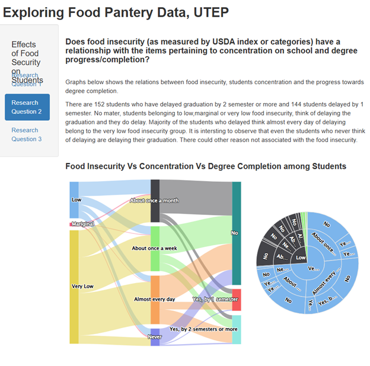
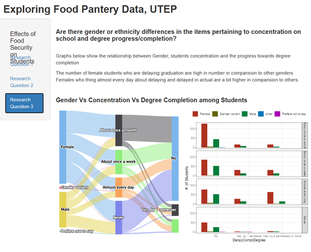

# Exploring Food Pantry Data at UTEP

This interactive Shiny web application explores the **University of Texas at El Paso (UTEP)** Food Pantry survey data to understand how **food insecurity** relates to students' **financial aid, academic concentration, and degree completion**.

---

##  Overview

The application is designed to answer three key research questions:

1. **Federal Aid vs. Food Insecurity**  
   How is the use of government federal aid or assistance associated with food insecurity (as measured by USDA indices)?
   
   

2. **Food Insecurity vs. Concentration and Degree Progress**  
   Does food insecurity relate to students' concentration levels and their progress toward degree completion?
   
   

3. **Gender and Ethnicity Differences**  
   Are there gender or ethnicity differences in concentration and degree progress?
   
   

---

##  Features

- **Interactive Visualizations** using:
  - `highcharter` (bar, sankey, sunburst charts)
  - `billboarder` (donut charts)
  - `ggplot2` (bar plots, faceting)
- **Dynamic Controls** such as year sliders.
- **Responsive UI** built with Shiny’s `navlistPanel` and `splitLayout`.

---

##  Data Description

The app uses two CSV datasets:
- **`master.csv`** — Contains demographic, aid, and USDA food insecurity data.
- **`extra_questions_withID.csv`** — Contains responses to additional academic and concentration questions.

Each dataset must include the following key columns:

| File | Important Columns |
|------|--------------------|
| `master.csv` | `Year`, `FedAid`, `index`, `RespondentId`, `Gender` |
| `extra_questions_withID.csv` | `RespondentId`, `DiffConcentrate`, `DelayComplDegree` |

---

##  Dependencies

The following R packages are required:

```r
install.packages(c(
  "shiny", "tidyverse", "highcharter", "billboarder",
  "ggpubr", "webr", "plotly"
))
```

---

##  Running the App

1. Clone this repository or download it as a ZIP:
   ```bash
   git clone https://github.com/cbkarki/Projects/utep_food_pantry_app.git
   ```

2. Place your data files (`master.csv`, `extra_questions_withID.csv`) in the app directory.

3. Launch the Shiny app:
   ```r
   shiny::runApp("path_to_app_folder")
   ```

4. The app will open automatically in your browser.

---

## File Structure

```
utep-food-pantry-app/
├── www/ # Folder for images and static assets
│ ├── tab1.png # Screenshot: Research Question 1 tab
│ ├── tab2.png # Screenshot: Research Question 2 tab
│ ├── tab3.png # Screenshot: Research Question 3 tab
│
├── master.csv # Main survey dataset
├── extra_questions_withID.csv # Supplementary survey dataset
├── app.R # Main Shiny application file
└── README.md # Project documentation
```

---

##  Author

**Chitra Karki**  
Data Science  
University of Texas at El Paso  
cbkarki@miners.utep.edu

---

